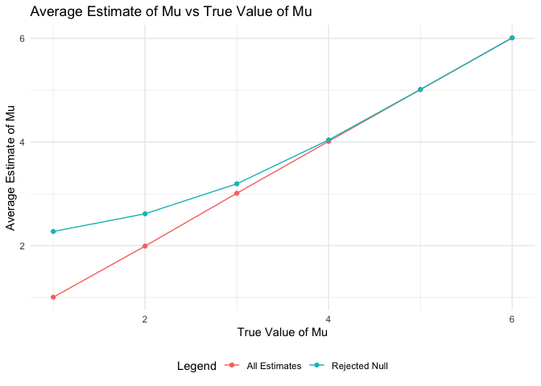

Homework5
================
Yunjia Liu
2024-11-13

## Problem 1

Generate a birthday simulation, which generates random birthdays and
checks for duplicates.

``` r
bday_simulation = function(group_size){
  birthdays <- sample(1:365, group_size, replace = TRUE)
  return(any(duplicated(birthdays)))
}
```

Initialize the group_size and number of simulations.

``` r
group_sizes <- 2:50
n_simulations <- 10000
probabilities <- numeric(length(group_sizes))
```

Run simulation.  
Perform simulations for the current group size using map_lgl.
mean(results) calculates the probability of at least one shared birthday
for group_size = i.  

``` r
for (i in 1:length(group_sizes)) {
  group_size = group_sizes[i]
  results = map_lgl(1:n_simulations, ~bday_simulation(group_size))
  probabilities[i] = mean(results)
}
output_df = tibble(
  group_size = group_sizes,
  probability = probabilities
  )
```

Plot the probabilities.  

``` r
ggplot(output_df, aes(x = group_size, y = probability)) +
  geom_line() +
  geom_point() +
  labs(
    title = "Probability of Shared Birthday vs. Group Size",
    x = "Group Size",
    y = "Probability of Duplicate Birthdays"
  ) +
  theme_minimal()
```

<!-- --> The plot
showcases the counterintuitive nature of the problem: even with a
seemingly small group (23 people), there is a high chance of at least
one shared birthday. The curve’s steep growth between group sizes 10 and
30 highlights how quickly the probability increases in that range.

## Problem 2

``` r
n = 30
sigma = 5
alpha = 0.05
mu_values = 0:6
n_simulations <- 5000
```

Function for every mu values:  
Generate data from normal distribution N(mu, sigma) and perform a
one-sample t-test using alpha=0.05. After that, we use broom::tidy()
function to extract estimate and p-value.

``` r
simulate_t_test <- function(n, mu, sigma, alpha) {
  data <- rnorm(n, mean = mu, sd = sigma)

  t_test_result = t.test(data, mu = 0)
  
  tidy_result = broom::tidy(t_test_result)
  estimate = tidy_result$estimate
  p_value = tidy_result$p.value
  reject_null = p_value < alpha
  
  tibble(
    u_hat = estimate, 
    p_value = p_value,
    reject_null = reject_null
  )

}
```

Do iteration for t-test simulation.

``` r
sim_results_df = 
  expand_grid(
    sample_size = n,
    mu = 1:6,
    iter = 1:n_simulations,
  ) |> 
  mutate(
    estimate_df = map(mu, ~simulate_t_test(n, .x, sigma,alpha))
  ) |> 
  unnest(estimate_df)
```

Calculate the power (proportion of times the null was rejected), average
estimate for all simulations (be it null rejected or not) and average
estimate when null is rejected.  
Since “reject_null” is a logical vector (TRUE if null was rejected) and
mean() of a logical vector in R treats TRUE as 1 and FALSE as 0,
mean(reject_null) gives the proportion of simulations where the null
hypothesis was rejected.  
u_hat\[reject_null\] subsets u_hat to include only estimates from
simulations where the null hypothesis was rejected.

``` r
summary_results = sim_results_df |>
  group_by(mu) |>
  summarise(
    power = mean(reject_null),                      
    avg_u_hat = mean(u_hat),                        
    avg_u_hat_rejected = mean(u_hat[reject_null])   
  )
```

Plot: Power vs True Value of Mu  
\#### For small effect sizes (e.g., mu = 0), power is close to zero,
indicating the test has low ability to detect small effects. As mu
increases, power approaches 1, showing that the test is more likely to
reject the null hypothesis when the true effect is larger.

``` r
ggplot(summary_results, aes(x = mu, y = power)) +
  geom_line(color = "blue") +
  geom_point(color = "blue") +
  labs(
    title = "Power vs True Value of Mu",
    x = "True Value of Mu",
    y = "Power (Proportion of Null Rejected)"
  ) +
  theme_minimal()
```

<!-- -->

Plot: Average Estimate vs True Value of Mu  
\#### The average estimate of mu-hat across all samples is approximately
equal to the true value of mu. This shows the test is unbiased on
average. The average mu_hat for rejected nulls is slightly larger than
the true value of mu. This occurs because rejecting the null requires
u_hat to be sufficiently far from 0, introducing selection bias.

``` r
ggplot(summary_results, aes(x = mu)) +
  geom_line(aes(y = avg_u_hat, color = "All Estimates")) +
  geom_line(aes(y = avg_u_hat_rejected, color = "Rejected Null")) +
  geom_point(aes(y = avg_u_hat, color = "All Estimates")) +
  geom_point(aes(y = avg_u_hat_rejected, color = "Rejected Null")) +
  labs(
    title = "Average Estimate of Mu vs True Value of Mu",
    x = "True Value of Mu",
    y = "Average Estimate of Mu",
    color = "Legend"
  ) +
  theme_minimal() +
  theme(legend.position="bottom")
```

<!-- -->

Answer to the question:   Across all samples, the sample average of
mu_hat is approximately equal to the true mu, confirming that the
estimator is unbiased. However, for samples where the null is rejected,
the average mu_hat is not equal to the true mu. This is due to
conditional bias: only samples with extreme values of mu_hat lead to
rejection of the null hypothesis.

## Problem 3

Load the dataset.

``` r
homicide_data = read_csv("./data/homicide-data.csv")
```

    ## Rows: 52179 Columns: 12
    ## ── Column specification ────────────────────────────────────────────────────────
    ## Delimiter: ","
    ## chr (9): uid, victim_last, victim_first, victim_race, victim_age, victim_sex...
    ## dbl (3): reported_date, lat, lon
    ## 
    ## ℹ Use `spec()` to retrieve the full column specification for this data.
    ## ℹ Specify the column types or set `show_col_types = FALSE` to quiet this message.

3.1 Describe the raw data.

``` r
cat("Number of rows:", nrow(homicide_data), "\n")
```

    ## Number of rows: 52179

``` r
cat("Number of columns:", ncol(homicide_data), "\n")
```

    ## Number of columns: 12

``` r
glimpse(homicide_data)
```

    ## Rows: 52,179
    ## Columns: 12
    ## $ uid           <chr> "Alb-000001", "Alb-000002", "Alb-000003", "Alb-000004", …
    ## $ reported_date <dbl> 20100504, 20100216, 20100601, 20100101, 20100102, 201001…
    ## $ victim_last   <chr> "GARCIA", "MONTOYA", "SATTERFIELD", "MENDIOLA", "MULA", …
    ## $ victim_first  <chr> "JUAN", "CAMERON", "VIVIANA", "CARLOS", "VIVIAN", "GERAL…
    ## $ victim_race   <chr> "Hispanic", "Hispanic", "White", "Hispanic", "White", "W…
    ## $ victim_age    <chr> "78", "17", "15", "32", "72", "91", "52", "52", "56", "4…
    ## $ victim_sex    <chr> "Male", "Male", "Female", "Male", "Female", "Female", "M…
    ## $ city          <chr> "Albuquerque", "Albuquerque", "Albuquerque", "Albuquerqu…
    ## $ state         <chr> "NM", "NM", "NM", "NM", "NM", "NM", "NM", "NM", "NM", "N…
    ## $ lat           <dbl> 35.09579, 35.05681, 35.08609, 35.07849, 35.13036, 35.151…
    ## $ lon           <dbl> -106.5386, -106.7153, -106.6956, -106.5561, -106.5810, -…
    ## $ disposition   <chr> "Closed without arrest", "Closed by arrest", "Closed wit…

3.2 Create city_state and summarize data by this new variable.

``` r
homicide_data = homicide_data |>
  janitor::clean_names() |>
  mutate(city_state = paste(city, state, sep = ", "))

city_state_summary = homicide_data |>
  group_by(city_state) |>
  summarise(
    total_homicides = n(),
    unsolved_homicides = sum(disposition %in% c("Closed without arrest", "Open/No arrest"))
  )

print(city_state_summary)
```

    ## # A tibble: 51 × 3
    ##    city_state      total_homicides unsolved_homicides
    ##    <chr>                     <int>              <int>
    ##  1 Albuquerque, NM             378                146
    ##  2 Atlanta, GA                 973                373
    ##  3 Baltimore, MD              2827               1825
    ##  4 Baton Rouge, LA             424                196
    ##  5 Birmingham, AL              800                347
    ##  6 Boston, MA                  614                310
    ##  7 Buffalo, NY                 521                319
    ##  8 Charlotte, NC               687                206
    ##  9 Chicago, IL                5535               4073
    ## 10 Cincinnati, OH              694                309
    ## # ℹ 41 more rows

3.2 Filter data for Baltimore, MD and perform proportion test for
Baltimore

``` r
baltimore_data = 
  city_state_summary |>
  filter(city_state == "Baltimore, MD")

baltimore_test = 
  prop.test(
    x = baltimore_data$unsolved_homicides,
    n = baltimore_data$total_homicides
    )

baltimore_results = broom::tidy(baltimore_test)

confidence_low = baltimore_results$conf.low
confidence_high = baltimore_results$conf.high
prop_estimate = baltimore_results$estimate

cat("For the city of Baltimore, MD, the proportion of homicides that are unsolved, \
    is estimated to be ",prop_estimate,"with confidence interval (", confidence_low, ",", confidence_high, ")")
```

    ## For the city of Baltimore, MD, the proportion of homicides that are unsolved, 
    ##     is estimated to be  0.6455607 with confidence interval ( 0.6275625 , 0.6631599 )

3.3 Perform proportion tests for all cities

``` r
city_state_results = 
  city_state_summary |>
  mutate(
    prop_test = 
      map2(unsolved_homicides, total_homicides, \(unsolved,total) prop.test(x = unsolved, n = total) |>
             broom::tidy() |>
             select(estimate, conf.low, conf.high)
           )
    ) |>
  unnest(prop_test)

city_state_results
```

    ## # A tibble: 51 × 6
    ##    city_state     total_homicides unsolved_homicides estimate conf.low conf.high
    ##    <chr>                    <int>              <int>    <dbl>    <dbl>     <dbl>
    ##  1 Albuquerque, …             378                146    0.386    0.337     0.438
    ##  2 Atlanta, GA                973                373    0.383    0.353     0.415
    ##  3 Baltimore, MD             2827               1825    0.646    0.628     0.663
    ##  4 Baton Rouge, …             424                196    0.462    0.414     0.511
    ##  5 Birmingham, AL             800                347    0.434    0.399     0.469
    ##  6 Boston, MA                 614                310    0.505    0.465     0.545
    ##  7 Buffalo, NY                521                319    0.612    0.569     0.654
    ##  8 Charlotte, NC              687                206    0.300    0.266     0.336
    ##  9 Chicago, IL               5535               4073    0.736    0.724     0.747
    ## 10 Cincinnati, OH             694                309    0.445    0.408     0.483
    ## # ℹ 41 more rows

3.4 Sort data by proportion of unsolved homicides and plot proportions
with confidence intervals
<!-- -->
